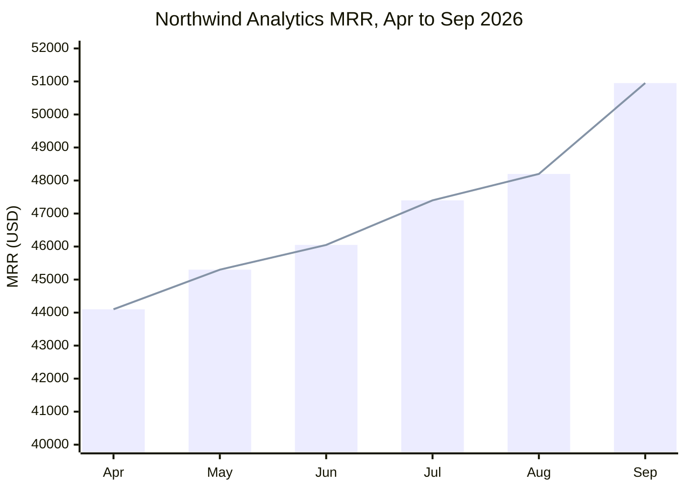

# Examples

All names and figures are fictional. Northwind Analytics Inc. (64 customers) appears
across the Advanced examples, so its numbers tie. Lakeshore Labs (38 customers, Stripe export)
shows the path for users outside Kick. Fernhill Software (13 customers) shows
the small-business shape; its figures come from a real `mrr_build.py` run with names
changed. Each Bad example matches an eval in `skills/mrr-arr-report-evals.json`.

## Good: first look with two questions (Advanced plan)

User: "Help me build an MRR report for Northwind Analytics."

```markdown
Northwind is at about **$50,950 MRR ($611,400 ARR)** across 64 customers, up from
$44,100 in April. 41 customers are on revenue schedules; the other 23 pay monthly with no
schedule, and their invoices say so. September was your best month: 3 new customers
added $3,600.

Two quick things before I write it up:

1. Who's it for? A quick read for you, a board or investor update, or a working view of
   customers and renewals?
2. Atlas Fieldworks paid $17,400 once, in March, and the invoice doesn't name a plan. Is
   that a yearly plan? If you're not sure, I'll count it in March only and note it.
```

Why it works: real numbers first, one thing that stands out, and only the two questions
the books can't answer. Everything else (spreading yearly payments, churn timing, period,
currency) is decided by default and shows up in "How I counted".

## Good: no questions needed, straight to the report (Basic plan)

User: "What's our MRR? I want to see how the business is doing month to month."

The purpose is clear (running the business) and every customer's bank description names
its plan and billing cycle, so the skill skips the questions and opens the report with
the first look. See the Fernhill Software report below.

## Good: grouping similar customers into one question

```markdown
8 customers each paid $480 once this year (Cinder, Harborline, Lumen & Co, and 5 more),
and the bank descriptions don't say what for. Are these yearly plans that started on the
payment date? If so, each counts as $40 a month.
```

Why it works: one question settles eight customers, in business words, with what the
answer changes.

## Good: outside Kick, asking for the data once

No Kick tools are connected. User: "Can you build our MRR? We bill through Stripe."

```markdown
Sure. A paid-invoices export from Stripe is all I need (Billing → Invoices → Export, the
last 12 to 18 months). If you have the subscriptions export too, send it along; it tells
me who pays monthly and who pays yearly.
```

Why it works: one ask, naming the export their tool already has. No column list, no
questions about definitions, no mention of Kick.

## Good: outside Kick, first look from a Stripe export

The user attached `invoices.csv` from Stripe.

```markdown
From your Stripe invoices (Oct 2025 to Sep 2026), Lakeshore Labs is at about **$14,250 MRR
($171,000 ARR)** across 38 customers, up from $11,900 in April. 31 pay monthly and 7
yearly, as Stripe shows; yearly plans are spread over 12 months. September added 4
customers ($1,150) and lost one ($300).

Who's it for? A quick read for you, a board or investor update, or a working view of
customers and renewals?
```

Why it works: the file's own interval column settles every billing cycle, so the only
question is purpose. "How I counted" in the report will add "paid invoices only, tax left
out, a management metric, not GAAP revenue".

## Good: outside Kick, payouts in a bank file

```markdown
Your bank file has 12 Stripe payouts ($9,840) in the window. Each is a batch of many
customers, net of fees, so I left them out rather than count Stripe as a customer. If you
send the Stripe invoices export, I'll add those customers in.
```

Why it works: it sizes what's left out, says why in plain words, and offers the one file
that fixes it.

## Good: report for running the business (Basic plan, 13 customers)

```markdown
# Fernhill Software: MRR, September 2026

**MRR $880 · ARR $10,560 · 13 customers · up 4.8% from August**

How I counted: money received on the cash ledger, by customer. Each payment is spread
over the billing cycle its bank description names (Plus quarterly $300 is $100 a month,
Basic annual $480 is $40 a month). Revenue starts in January 2026, so everyone active
then counts as new in January. A management metric, not GAAP revenue.

## Your customers

| Customer | Plan | Billing | Customer since | MRR | Next renewal | September |
|---|---|---|---|---|---|---|
| Alder Co | Plus | Quarterly | Jan 2026 | $100 | Oct 2026 | No change |
| Birchway | Plus | Quarterly | Jan 2026 | $100 | Oct 2026 | No change |
| Cobalt Print | Plus | Quarterly | Jan 2026 | $100 | Oct 2026 | No change |
| Dovetail | Plus | Quarterly | Jan 2026 | $100 | Oct 2026 | No change |
| Elmstead | Plus | Quarterly | Jan 2026 | $100 | Oct 2026 | No change |
| Foxglove Labs | Plus | Quarterly | Jan 2026 | $100 | Oct 2026 | No change |
| Garnet & Co | Basic | Annual | Jan 2026 | $40 | Jan 2027 | No change |
| Hollis | Basic | Annual | Feb 2026 | $40 | Feb 2027 | No change |
| Ivy Lane | Basic | Annual | Mar 2026 | $40 | Mar 2027 | No change |
| Juniper | Basic | Annual | Apr 2026 | $40 | Apr 2027 | No change |
| Kettle & Co | Basic | Annual | May 2026 | $40 | May 2027 | No change |
| Lark Studio | Basic | Annual | Jul 2026 | $40 | Jul 2027 | No change |
| Moss Supply | Basic | Annual | Sep 2026 | $40 | Sep 2027 | New |

## By plan

| Plan | Customers | MRR | Share | Per customer |
|---|---|---|---|---|
| Plus | 6 | $600 | 68.2% | $100 |
| Basic | 7 | $280 | 31.8% | $40 |

## Trend

| Month | MRR | Customers |
|---|---|---|
| Jan | $640 | 7 |
| Mar | $720 | 9 |
| May | $800 | 11 |
| Jul | $840 | 12 |
| Sep | $880 | 13 |

## What stands out

- **Steady growth, no churn.** One new Basic customer most months, and nobody lost or
  downgraded all year.
- **Every new customer since January chose Basic.** That's why revenue per customer fell
  from $91.43 to $67.69. Plus brings in $100 a customer against Basic's $40.
- **All 6 Plus customers renew in October**, $600 of your $880. That's the month to watch.

## What's missing

- Nothing that changes these numbers. Fernhill is on Basic, so Kick has no contract terms;
  billing cycles come from the bank descriptions.

Want a one-page dashboard file with the customer CSV, a live version in Google Sheets that
updates as the Kick add-on syncs, or this as a board scorecard?
```

Why it works: with 13 customers, every customer is named with plan, billing, and renewal.
Plan mix explains the drop in revenue per customer. No cohort table (cohorts would be 1 or
2 customers) and no retention (less than 13 months of data). The three insights are things
the owner can act on.

## Good: full report for a board or running the business (Advanced plan, 64 customers)

```markdown
# Northwind Analytics Inc.: MRR and ARR, September 2026

**MRR $50,950 · ARR $611,400 · 64 customers · up 5.7% from August**

How I counted: recognized revenue from schedules for 41 customers (76% of MRR) and booked
revenue for the other 23. Recurring revenue is 4010 Subscription revenue; yearly payments
are spread over their term. Atlas Fieldworks is a yearly plan from March, as you said. A
management metric, not GAAP revenue.

## Trend

| Month | MRR | Change | Customers | ARPA |
|---|---|---|---|---|
| Apr 2026 | $44,100 | | 57 | $774 |
| May 2026 | $45,300 | +2.7% | 59 | $768 |
| Jun 2026 | $46,050 | +1.7% | 60 | $768 |
| Jul 2026 | $47,400 | +2.9% | 61 | $777 |
| Aug 2026 | $48,200 | +1.7% | 62 | $777 |
| Sep 2026 | $50,950 | +5.7% | 64 | $796 |

## What moved in September

| Movement | MRR | Customers | Biggest |
|---|---|---|---|
| Opening (Aug) | $48,200 | 62 | |
| New | +$3,600 | 3 | Brightline Labs $1,500, Orchard Health $1,200 |
| Expansion | +$1,450 | 3 | Meridian Retail +$800 |
| Reactivation | +$400 | 1 | Lumen Yoga $400 |
| Contraction | -$600 | 2 | Pinecrest Dental -$350 |
| Churn | -$2,100 | 2 | Saltmarsh Media -$1,300, Quarry Logistics -$800 |
| Closing (Sep) | $50,950 | 64 | Ties to the movements |

12-month net revenue retention is 104% and gross revenue retention is 93%, for the 55
customers active in September 2025.

## Top customers

| Customer | MRR | Share | September |
|---|---|---|---|
| Meridian Retail | $3,100 | 6.1% | Expanded +$800 |
| Northgate Clinics | $2,400 | 4.7% | No change |
| Brightline Labs | $1,500 | 2.9% | New |
| Atlas Fieldworks | $1,450 | 2.8% | No change |
| Orchard Health | $1,200 | 2.4% | New |

The top 10 customers make up 31% of MRR.

## What stands out

- September was the best month this year. New customers alone ($3,600) covered churn
  ($2,100) with room to spare.
- 4 schedules end before December 7. Together they're $5,200 of MRR up for renewal.
- Over the 12 months you booked $22,100 more than you collected. Most of it is 7 open
  annual invoices.

## What's missing

- **11 deposits in September have no customer** ($7,840). They're left out of MRR.
  Assign a counterparty in Kick and re-run.
- **Northgate Clinics shows up twice** (Northgate Clinics LLC until May, Northgate Clinics
  from June). That creates a false $2,400 churn and a matching new customer in June.
  Merging them in Kick fixes it.
- **6 annual invoices have no schedule** ($28,800 billed). I counted them in the month
  billed. With schedules they'd add about $2,400 a month and smooth the trend. The
  revenue recognition review in Kick lists them.
- **4050 Services revenue may hold retainers.** 38% of it comes from repeat customers.
  If those are recurring, MRR is understated by up to $1,900 a month. Tell me and I'll
  include it.
- **2 EUR customers** (€1,150 a month) are not in the totals.
- Kick doesn't have plan names, billing intervals, or cancel dates for subscriptions
  billed outside Kick, so churn timing is based on when revenue stops.

Want a one-page dashboard file with the customer CSV, a live version in Google Sheets, or
the board scorecard and quarterly ARR bridge?
```

## Good: "How I counted" and differences on Plus

Only the parts that change from the Advanced report. The user answered the first-look
question about Atlas Fieldworks; Kestrel Ops pays irregularly and the user didn't know.

```markdown
# Northwind Analytics Inc.: MRR and ARR, September 2026

How I counted: booked revenue on the accrual ledger, by customer. Billing cycles come
from invoice descriptions (51 customers), payment history (11), and your answer about
Atlas Fieldworks. Kestrel Ops pays irregularly, so I counted each payment in the month it
was booked. A management metric, not GAAP revenue.
```

In "What's missing", the Plus report adds one line and drops the schedule lines:

```markdown
- Contract terms come from revenue recognition schedules, which are on the Advanced plan.
  Without them, billing cycles come from descriptions, payment history, and your answers.
  Kestrel Ops ($1,100 in the window) is counted when paid until we know how it bills.
```

## Good: "How I counted" on Basic

```markdown
How I counted: money received, by customer, on the cash ledger. MRR follows when customers
paid, so a yearly payment with no plan in its description shows up as one big month unless
you tell me it's yearly. A management metric, not GAAP revenue.
```

## Good: Free workspace

```markdown
I can't build this one for Northwind Analytics. The Kick MCP tools I need aren't available
on this workspace's plan, so I can't read its revenue. Your other workspaces may still
work. Want me to try one of them?
```

## Good: method note after a corrected call

```markdown
Note: one step worked differently than this skill describes: the monthly P&L by customer
needed the date range inside the report parameters, not at the top level. Please forward
this note to whoever sent you the skill.
```

## Typical MRR/ARR report formats

Used when the purpose calls for them or the user asks. All of them read the same build
JSON and tie to the full report: September closing MRR is $50,950 in every format.

### KPI scorecard (board one-pager)

```markdown
# Northwind Analytics Inc.: SaaS metrics, September 2026

| Metric | Sep 2026 | Aug 2026 | Change |
|---|---|---|---|
| MRR | $50,950 | $48,200 | +5.7% |
| ARR | $611,400 | $578,400 | +$33,000 |
| Net new MRR | $2,750 | $800 | +$1,950 |
| Customers | 64 | 62 | +2 |
| ARPA | $796 | $777 | +$19 |
| Logo churn | 3.2% | 1.6% | +1.6 pts |
| Gross MRR churn | 5.6% | 1.9% | +3.7 pts |
| Net MRR churn | 2.6% | 0.8% | +1.8 pts |
| Quick ratio | 2.0 | 1.9 | +0.1 |
| NRR (12 months) | 104% | | |
| GRR (12 months) | 93% | | |

Definitions: logo churn is churned customers / opening customers. Gross MRR churn is
(churn + contraction) / opening MRR. Net MRR churn is (churn + contraction - expansion) /
opening MRR. Quick ratio is (new + expansion + reactivation) / (churn + contraction).
```

### MRR movement waterfall by month

Each row ties: opening + movements = closing.

```markdown
| Month | Opening | New | Expansion | Reactivation | Contraction | Churn | Closing | Net new |
|---|---|---|---|---|---|---|---|---|
| May 2026 | $44,100 | +$1,800 | +$600 | $0 | -$300 | -$900 | $45,300 | +$1,200 |
| Jun 2026 | $45,300 | +$3,900 | +$700 | $0 | -$250 | -$3,600 | $46,050 | +$750 |
| Jul 2026 | $46,050 | +$1,600 | +$900 | +$250 | -$400 | -$1,000 | $47,400 | +$1,350 |
| Aug 2026 | $47,400 | +$1,200 | +$500 | $0 | -$200 | -$700 | $48,200 | +$800 |
| Sep 2026 | $48,200 | +$3,600 | +$1,450 | +$400 | -$600 | -$2,100 | $50,950 | +$2,750 |

June includes a false $2,400 churn and a matching $2,400 new customer from the
Northgate Clinics duplicate (see "What's missing" in the full report).
```

### ARR bridge by quarter

Each movement is the quarter's MRR movements times 12.

```markdown
# ARR bridge, Q3 2026

| | ARR |
|---|---|
| Opening ARR (Jun 30) | $552,600 |
| New | +$76,800 |
| Expansion | +$34,200 |
| Reactivation | +$7,800 |
| Contraction | -$14,400 |
| Churn | -$45,600 |
| Closing ARR (Sep 30) | $611,400 |

ARR grew $58,800 (10.6%) in the quarter.
```

### Customer view

The detail behind every other format, from `customers` in the build JSON. The CSV
(`customer_detail.csv`) has the same columns plus MRR for every month.

```markdown
| Customer | Plan | Billing | Customer since | Jul | Aug | Sep | Next renewal | September |
|---|---|---|---|---|---|---|---|---|
| Meridian Retail | Pro | Monthly | Nov 2024 | $2,300 | $2,300 | $3,100 | | Upgraded +$800 |
| Northgate Clinics | Enterprise | Monthly | Jun 2026 | $2,400 | $2,400 | $2,400 | | Active |
| Brightline Labs | Enterprise | Monthly | Sep 2026 | $0 | $0 | $1,500 | | New |
| Atlas Fieldworks | Pro | Annual | Mar 2026 | $1,450 | $1,450 | $1,450 | Mar 2027 | Active |
| Lumen Yoga | Core | Monthly | Feb 2026 | $0 | $0 | $400 | | Came back |
| Saltmarsh Media | Pro | Monthly | Jan 2025 | $1,300 | $1,300 | $0 | | Churned |
| Northgate Clinics LLC | Enterprise | Monthly | Jan 2025 | $0 | $0 | $0 | | Churned in Jun 2026 (likely the same customer as Northgate Clinics) |
| ... all other customers | | | | | | | | |
| **Total** | | | | **$47,400** | **$48,200** | **$50,950** | | |
```

### MRR by plan or product line

From the `plan` column (descriptions, policy names, or answers), or classes (Plus and up).

```markdown
| Plan | MRR | Share | Customers | ARPA | Net new in Sep |
|---|---|---|---|---|---|
| Core | $14,450 | 28.4% | 34 | $425 | +$400 |
| Pro | $21,300 | 41.8% | 22 | $968 | +$850 |
| Enterprise | $15,200 | 29.8% | 8 | $1,900 | +$1,500 |
| **Total** | **$50,950** | **100%** | **64** | **$796** | **+$2,750** |
```

### Revenue retention by cohort

Above 100% means the cohort grew. Needs at least 3 quarters of history and cohorts of 5
or more customers; skip it for small businesses.

```markdown
| Start cohort | Customers | Starting MRR | Month 3 | Month 6 | Month 9 |
|---|---|---|---|---|---|
| Q4 2025 | 9 | $6,300 | 97% | 101% | 106% |
| Q1 2026 | 7 | $5,100 | 94% | 98% | |
| Q2 2026 | 8 | $6,700 | 99% | | |
```

### MRR trend chart

For surfaces that render Mermaid. In plain chat, the trend table stands in for it.



## Good: dashboard (Advanced plan, user picked it)

The file is built by `scripts/build_dashboard.py` from the same build JSON as the report,
using `templates/dashboard.html`. The chat message that comes with it keeps the insights:

```markdown
Here's the dashboard: northwind-analytics-mrr-dashboard-2026-09.html, plus
northwind-analytics-customers-2026-09.csv with every customer's plan, billing, renewal,
and MRR by month.

It's a snapshot of Kick data as of October 8, so it won't update by itself. If you'd
like one that does, I can set it up in your Google Sheet with the Kick add-on.

Three things worth a look:
- September was the best month this year: $2,750 net new MRR, driven by 3 new customers.
- 4 schedules worth $5,200 of MRR end before December 7.
- The June dip in the movements chart is partly the Northgate Clinics duplicate. Merging the
  two customers in Kick removes it.
```

Panels without data are left out: "Up for renewal" needs schedules or yearly and quarterly
billing, "MRR by plan" needs plan names or classes, and cohorts need 5 or more customers
per start quarter. With 25 or fewer customers, the customer panel lists everyone.

## Good: dashboard asked for where files can't be saved

```markdown
I can't save files here, so there's no dashboard file this time. Here are the same numbers
as a scorecard and a trend chart you can paste anywhere. Run me in a place that can save
files (Claude desktop, for example) and I'll build the HTML page.
```

Followed by the KPI scorecard and the Mermaid trend chart above.

## Good: first look from a Google Sheet, after the inventory

User sends a spreadsheet link. The chat lists the tabs, reads each one, runs
`sheet_sources.py inventory`, builds rows with `rows`, and runs the scan and build before
saying anything.

```markdown
I read all 7 tabs. Five are Kick reports for Harbor Analytics (P&L, Balance Sheet,
General Ledger, Revenue Waterfall, Revenue Rollforward, all accrual, January to September
2026), one is your Stripe invoices export, and one is an old notes tab I left alone.

Harbor is at about **$38,400 MRR ($460,800 ARR)** across 31 customers, up from $36,900 in
August. I'm taking 19 customers from the Waterfall (their schedules), 9 from your Stripe
tab, and 3 from the ledger; their ledger lines are then left out so nothing counts twice.
The Rollforward gives me 4 schedules ending before December.

One thing before I write it up: who's it for? A quick read, a board or investor update, or
a working view of customers and renewals?
```

## Good: stale ledger, stopped before building

```markdown
One check before the numbers. The General Ledger tab's header says January 1 to
September 30, 2026, but its last line is June 28. Three months are missing, and the
Waterfall covers only customers on schedules, so I can't build July to September yet.

In this sheet, open Extensions → Add-ons → Kick and pull General Ledger again for Harbor
Analytics, Accrual ledger, January 1 to September 30, 2026, with auto-refresh on. Tell
me when it's done, or say "go ahead" and I'll report January to June and say so.
```

## Good: test data, gate first

```markdown
Before anything else: these books look like test data. Two of the five customer names
say "Test" or "QA", the entity is called "Manual QA source", and 69 percent of the
revenue has no customer at all ($4,310 of $6,250).

I can still build the report, with a "Test or incomplete data" line on it and on the
dashboard. Want me to go ahead, and should the $4,310 with no customer stay out (my
default) or be shown as one "Unassigned" line?
```

## Good: a refused write, reported

```markdown
The second write was refused by the Sheets connection, so I stopped. Here's what exists
right now, all added by me and nothing else touched:

- MRR settings (id 1849201034), MRR sources (id 1849201035), MRR inputs (id 1849201036)
- Not created yet: MRR rows, MRR grid, MRR movements, MRR customers, MRR report,
  MRR dashboard

Three ways forward: I retry the remaining writes; you paste the installer file into
Extensions → Apps Script and run it, which finishes the same plan; or I delete the three
tabs above and we leave the sheet as it was.
```

## Bad: reading one tab and asking for a pull

```markdown
To build the live sheet I need the General Ledger. Please open the Kick add-on and pull
it, then send me the link again.
```

Why it's bad: the spreadsheet already had a Waterfall, a Rollforward, and a Stripe export
two tabs over. Inventory every tab first; ask for a pull only when no tab covers the
window, and say which report, basis, entity, and dates.

## Bad: a polished board report on test books

```markdown
# Manual QA source: Q3 board update
ARR $75,000, up 240% quarter over quarter. Net revenue retention 310%.
```

Why it's bad: the entity name says QA, two customers are "Test Customer", and most of the
revenue has no customer. The gate fires; the first look leads with it and asks once. A
board shape built anyway carries the data-quality line and the dashboard banner.

## Bad: a form instead of a conversation

Matches eval 12.

```markdown
## Report options

| # | Option | Default |
|---|---|---|
| 1 | Where MRR comes from | Deposits (cash collected) |
| 2 | Which revenue counts as recurring | All 33 deposits ("mixed" account) |
| 3 | Minimum history to count as recurring | 2 months |
| 4 | Annual and quarterly payments | Spread across the term |
| 5 | Metrics | All. NRR and GRR need 13 months |
| 6 | Churn rule | Churned after 1 month with no revenue |
| ... 5 more rows ... | | |

## Questions about specific customers
1. Tarn Analytics ($12,000, Oct 1): is this an annual plan, and when did it start?
2. The eight $480 customers: are these all annual plans?

Reply with any changes, or **go**.
```

Why it's bad: eleven settings the user never cares about, in method words (minimum
history, mixed account, churn rule), before they've seen a single number. Decide those by
default, open with what you found, and ask at most two things.

## Bad: asking what the books already say

Matches eval 13.

```markdown
The eight $480 customers: are these annual "Basic" plans that start on the payment date?
```

Why it's bad: every one of those payments had "Basic annual" in its bank description, so
the user had to ask "can't you see this in Kick?" Read descriptions before asking; the
scan marks those customers `described` and leaves them out of the questions.

## Bad: Kick words for someone outside Kick

The user sent a Stripe export; no Kick tools are connected.

```markdown
Your workspace isn't on a Kick plan, so I used cash collected. Upgrade to Advanced for
revenue schedules, and assign classes to see MRR by plan.
```

Why it's bad: workspace, plans, Advanced, schedules, and classes mean nothing to this
user, and the upgrade line is a pitch. The source is their Stripe export, plans come from
its product names, and "How I counted" names the file and its dates.

## Bad: asking an outside user for a data format

```markdown
Please send a CSV with these columns: customer_id, customer_name, invoice_date
(YYYY-MM-DD), amount_usd, billing_interval, plan_name. Also tell me:
1. Which revenue counts as recurring?
2. Should annual payments be spread?
3. How many months without payment counts as churn?
```

Why it's bad: the user has to build a file and answer a form before seeing anything. Ask
for the standard export their tool already makes, map its columns yourself, and decide
the rest by default.

## Bad: asking a Kick user for a Stripe export

The business is a Kick entity on Basic. "Send me your Stripe export so I can see plans
and billing cycles."

Why it's bad: Kick users get the report from Kick reads. Billing cycles come from
descriptions and payment patterns; what Kick can't see goes in what's missing (G7).

## Bad: a customer file with internal columns

Matches eval 14.

```csv
customer,cadence,source,class,2026-01,...,latest_movement,latest_movement_amount
Alder Co,detected,cash,,100.00,...,none,0.00
```

Why it's bad: `cadence`, `source`, and `latest_movement` mean nothing to a reader, and
`source` and `class` are the same in every row. The build writes `customer_detail.csv`
with Plan, Billing, Started, Next renewal, MRR by month, and Status; hand over that file.

## Bad: "Uncategorized" revenue in a GL-first workspace

Matches eval 15.

```markdown
- 33 deposits ($23,040) are Uncategorized and need to be booked.
```

Why it's bad: the workspace is GL-first, so transaction search shows the unused category
field. The cash P&L already had all $23,040 in Revenue. Read revenue from the P&L and the
general ledger detail by account.

## Bad: a dashboard with typed-in numbers and prose

Matches eval 10.

```html
<div class="kpi">MRR <b>$51,000</b></div>
<p>Great month! Northwind is growing fast and churn is under control.</p>
<script src="https://cdn.example.com/charts.js"></script>
```

Why it's bad: $51,000 was rounded by hand and doesn't match the report ($50,950). The prose
belongs in chat, and "under control" isn't backed by any figure (logo churn doubled). The
external script breaks offline and in email. Every number on the page comes from the
build script, and the file loads nothing from the network.

## Bad: promising a file the surface can't save

Matches eval 11.

```markdown
Done! Your dashboard is saved as northwind-analytics-mrr-dashboard-2026-09.html.
```

Why it's bad: nothing was written, so the user goes looking for a file that doesn't exist.
Say the surface can't save files and send the scorecard and trend chart in chat.

## Bad: ARR summed over the year

Matches eval 1.

```markdown
ARR (Oct 2025 to Sep 2026): $528,000
```

Why it's bad: that's 12 months of MRR added up. ARR is the latest month's MRR times 12
($611,400). The report states ARR for a month, never for a range.

## Bad: the bridge doesn't tie

Matches eval 4.

```markdown
| Opening (Aug) | $48,200 |
| New | +$3,600 |
| Churn | -$2,100 |
| Closing (Sep) | $50,950 |
```

Why it's bad: the rows add to $49,700, not $50,950. Expansion, contraction, and
reactivation were dropped, and nothing flags the difference. The script's bridge check
must pass before the report goes out, and every movement row is shown.

## Bad: retrying the plan gate and pushing the upgrade

Matches eval 2.

```markdown
I tried to read your revenue schedules but got an error. Trying again... Still failing.
Upgrade to Advanced to get the real MRR report! With Advanced you also get consolidation
and...
```

Why it's bad: a plan gate isn't a transient error, so the retry wastes a call. "Real MRR
report" implies the Plus report is wrong. Switch to the ledger source, label the report,
and mention the plan limit once in the gaps section.

## Bad: guessing an unclear billing cycle

Matches evals 2 and 9.

```markdown
Atlas Fieldworks: annual, $1,450 a month.
```

Why it's bad: one payment in the window doesn't prove an annual plan. It could be a
one-time project. Ask about Atlas Fieldworks in the first look. If the user doesn't know,
the $17,400 is counted in March and "How I counted" says so.

## Bad: dropping customers without saying so

Matches eval 4.

```markdown
**MRR $43,110 · 52 customers**
```

Why it's bad: deposits with no customer and the EUR customers were left out, and the
report doesn't say so. Every exclusion appears in "What's missing" with its count and
amount.

## Bad: a cash report that reads like booked revenue

Matches eval 3.

```markdown
Plan: Basic. MRR $50,950. Atlas Fieldworks expanded +$17,400 in March.
```

Why it's bad: on Basic the source is money received, so Atlas Fieldworks' annual payment
looks like a one-month jump. "How I counted" has to say MRR follows when customers paid.

## Bad: hiding a corrected call

Matches eval 8.

```markdown
(Report delivered with no mention that the P&L call was rejected and retried.)
```

Why it's bad: the fix worked, but nobody upstream learns the binding is stale. End the
report with the one-line method note.

## Bad: triggering on a booking request

Matches eval 6.

User: "Recognize September's deferred revenue for Northwind."

```markdown
Here's Northwind's MRR for September: $50,950...
```

Why it's bad: the user wants journal entries posted, not a metric. This skill doesn't
trigger. Booking revenue recognition belongs to a revenue recognition skill.
